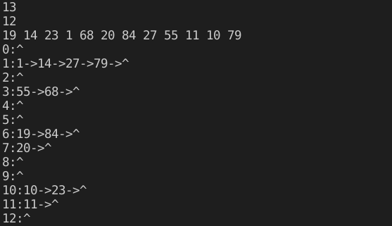
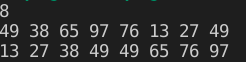

## 9.19

散列地址|0|1|2|3|4|5|6|7|8|9|10|
:--:|:--:|:--:|:--:|:--:|:--:|:--:|:--:|:--:|:--:|:--:|:--:|
关键字|22|30 |41| 1|13 |53|46| | | |67

key|次数
:--:|:--:|
22|1
41|1
53|1
46|1
30|2
13|3
1|1
67|2
$ASL(8)=\frac{1}{8}(1\times5+2\times2+3)=1.5$

## 9.45

```c++
typedef int KeyType;

typedef struct HashNode //  链上节点
{
    KeyType key;
    struct HashNode *next;
} HashNode, *HashTable;

void CreateHashTable(HashTable *table)
{
    int i = 0;
    int m = 0;
    scanf("%d", &m);    //  Hash表长度

    table = (HashTable *)malloc(sizeof(*table) * m);    //  包含m个指针的指针数组
    for (i = 0; i < m; i++)
    {
        table[i] = (HashTable)malloc(sizeof(*table[i]));    //  每个位置对应的头结点
        table[i]->next = nullptr;
    }

    int num = 0;
    scanf("%d", &num);  //  关键字序列个数
    KeyType *key_in = (KeyType *)malloc(sizeof(*key_in) * num);
    for (i = 0; i < num; i++)
    {
        scanf("%d", &key_in[i]);
        Insert(table[H(key_in[i], m)], key_in[i]);      //  插入key，在H(key)得到的相应的链表中
    }
    Print(table, m);
}

int H(KeyType x, int m)
{
    return x % m;
}

void Insert(HashTable head, KeyType key) //  这里head是多出来的那个头结点，不是有数据的头结点
{
    HashTable p = head->next;
    HashTable p_pre = head;
    while (p != nullptr)
    {
        if (p->key > key)   //  p_pre->key <= key && p->key > key
            break;
        else
        {
            p_pre = p;
            p = p->next;
        }
    }
    HashTable new_p = (HashTable)malloc(sizeof(*new_p));
    new_p->key = key;
    new_p->next = p;
    p_pre->next = new_p;
}

void Print(HashTable *table, int m)
{
    int i = 0;
    for (i = 0; i < m; i++)
    {
        printf("%d ", i);
        HashTable p = table[i]->next;
        while (p != nullptr)
        {
            printf("%d ", p->key);
            p = p->next;
        }
        putchar('\n');
    }
}

```

*   书上例子结果



# 10.30

```c++
//  教材上的
int Partition(SqList & L, int low, int high)
{
    L.r[0] = L.r[low];
    int pivotkey = L.r[low].key;
    while (low < high)
    {
        while (low < high && L.r[high].key >= pivotkey) --high;
        L.r[low] = L.r[high];
        while (low < high && L.r[low].key <= pivotkey) ++low;
        L.r[high] = L.r[low];
    }
    L.r[low] = L.r[0];
    return low;
}

//  按照题目的要求，应该是在进行Partition之后先对左序列排序，暂存右序列，左序列全部排完之后再排右序列
//  所以，这里就在Partition之后先把右序列的上下界入栈，然后再将左序列的上下界入栈，下一次循环的时候又会将左序列的上下界出栈
//  进行排序，重复操作。就相当于对左序列的深度优先排序。如果上下界之差小于2，即待排数为3，则冒泡排序
void QSortNoRecursion(SqList &L, int low, int high)
{
    SqStack S;
    InitStack(S);
    Push(S, high);
    Push(S, low);
    while (!StackEmpty(S))
    {
        int part_low, part_high;
        Pop(S, part_low);
        Pop(S, part_high);
        if (part_high - part_low <= 2)
        {
            for (int i = part_low; i < part_high; i++)
            {
                for (int j = part_high; j > i; j--)
                {
                    if (LT(L.r[j].key ,L.r[j-1].key))
                    {
                        KeyType t = L.r[j].key;
                        L.r[j].key = L.r[j-1].key;
                        L.r[j-1].key = t;
                    }
                }
            }
        }
        else
        {
            int pivotloc = Partition(L, part_low, part_high);
            Push(S, part_high);
            Push(S, pivotloc+1);
            Push(S, pivotloc-1);
            Push(S, part_low);
        }
    }
}

void QuickSortNoRecursion(SqList &L)
{
    QSortNoRecursion(L, 1, L.length);
}

```

对L进行赋值，测试结果为



# 10.32

> 0代表红色，1代表白色，2代表蓝色

```c++
int ThreeColorSort(SqList &L)
{
    int num_red = 0, num_blue = 0;
    int i = 1;
    for (i = 1; i <= L.length; i++)
    {
        if (L.r[i].key == 0)
            ++num_red;
        else if (L.r[i].key == 2)
            ++num_blue;
    }
    for (i = 1; i <= num_red; i++)
        L.r[i].key = 0;
    for (; i <= L.length-num_blue; i++)
        L.r[i].key = 1;
    for (; i <= L.length; i++)
        L.r[i].key = 2;
    
    return OK;
}
```


# 10.34

```c++
void InsertHeap(HeapType &H, RedType k)
{
    H.length++;
    H.r = (RedType *)realloc(H.r, (H.length+1) * sizeof(*H.r));
    H.r[H.length] = k;

    int j = H.length;
    while (j != 1)
    {
        if (LT(H.r[j/2].key, H.r[j].key))
        {
            RedType t = H.r[j/2];
            H.r[j/2] = H.r[j];
            H.r[j] = t;
            j /= 2;
        }
        else break;
    }
}
```

*   从最后插入的节点开始，往上进行调整(这里假设原来的堆是大根堆)，如果没有调整，则这个数已经到了合适的位置。
